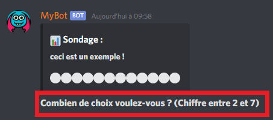

# Bien commencer

## Ajouter le bot

Pour ajouter le bot, [clique ici](https://discordapp.com/oauth2/authorize?client_id=500023552905314304&scope=bot&permissions=805596240).  
Pour obtenir de l'aide, tu peux rejoindre le [serveur support](https://discord.gg/GKTgHAf).

## Configurer le bot

Maintenant, tu peux par exemple définir un préfixe personnalisé avec la commande `!config`



## Utiliser le bot

Ensuite, pour savoir en détail ce que fait le bot, je t'invite à te référer aux pages suivantes :



